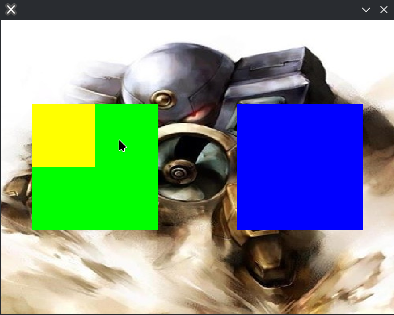

# arisu

A painting program implemented entirely from scratch in LuaJIT.

## Support

This only supports Linux due rolling its own window management, input handling, and OpenGL context creation using X11 and GLX.

It works on wayland via XWayland of course.

## Goals

- Be fast and lightweight
- Be entirely from scratch
- Implementing GPU accelerated painting operations from [Ciallo](https://dl.acm.org/doi/10.1145/3641519.3657418) via OpenGL Compute Shaders

## Showcase

