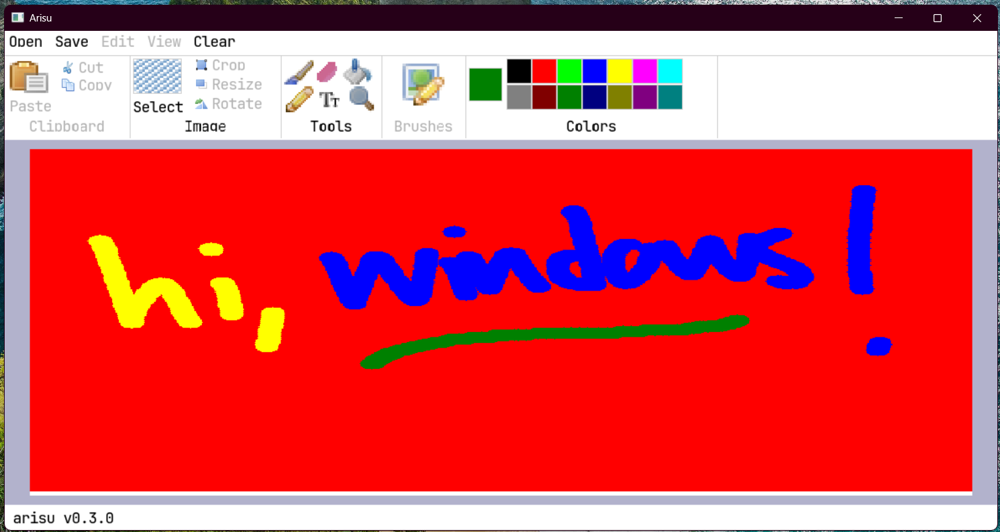

# arisu

A painting program implemented entirely from scratch in LuaJIT.

## Requirements

- Linux or Windows (Linux is recommended)
- Support for OpenGL 4.3 (you most certainly have this)
- _That's it._

There are no dependencies used by the library. Pure X11/Win32 and OpenGL.

## Goals

- Be fast and lightweight
- Be entirely from scratch
- Implementing GPU accelerated painting operations from [Ciallo](https://dl.acm.org/doi/10.1145/3641519.3657418) via OpenGL Compute Shaders

## Showcase

## Attributions

### Icons

Almost all of the icons are sourced from FamFamFam (Mark James)'s Silk icon set.

The rest are made by me sloppily in GIMP.

### Sound

Free sounds are sourced from [ZapSplat](https://www.zapsplat.com).
