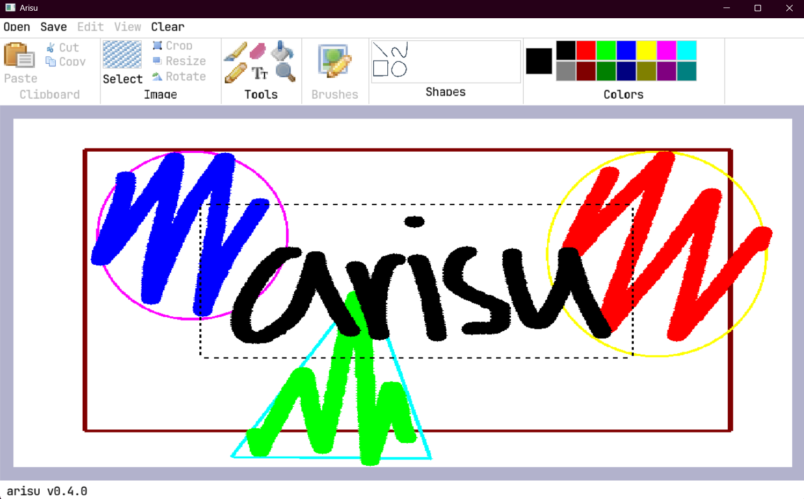
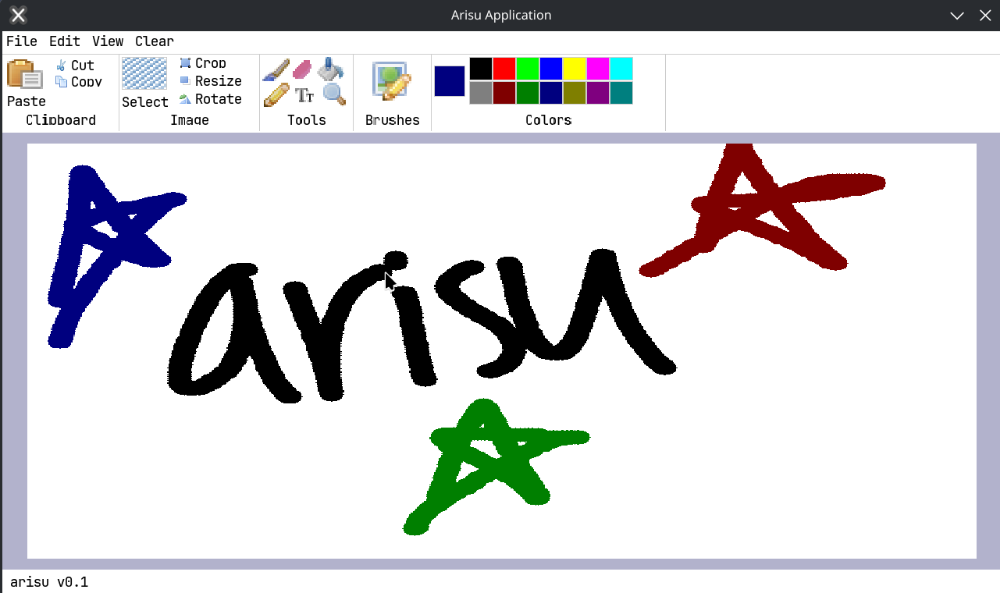

# arisu

A painting program implemented entirely from scratch in LuaJIT.

> [!NOTE]
> This has recently transitioned from pure OpenGL to my cross-platform graphics library, [hood](https://github.com/bycruz/hood). Use `VULKAN=1 lde run` to run with vulkan.

## Requirements

- Linux (Recommended) or Windows
- Support for OpenGL 4.3 (you most certainly have this) or Vulkan 1.0
- _That's it._

There are no dependencies used by the library. Pure X11/Win32 and OpenGL.

## Goals

- [x] Fast
    - Best practices in the GPU pipeline and when writing LuaJIT code.
- [x] Written from scratch
    - **Zero** dependencies
- [x] Implement all painting operations on the GPU
    - Canvas is stored on the GPU and manipulated purely with compute shaders

## Showcase

## Running

1. Set up [lde](https://lde.sh) on your system.
2. Run `lde run` inside of `./packages/arisu`.

## Attributions

### Icons

Almost all of the icons are sourced from FamFamFam (Mark James)'s Silk icon set.

The rest are made by me sloppily in GIMP.

### Sound

Free sounds are sourced from [ZapSplat](https://www.zapsplat.com).
